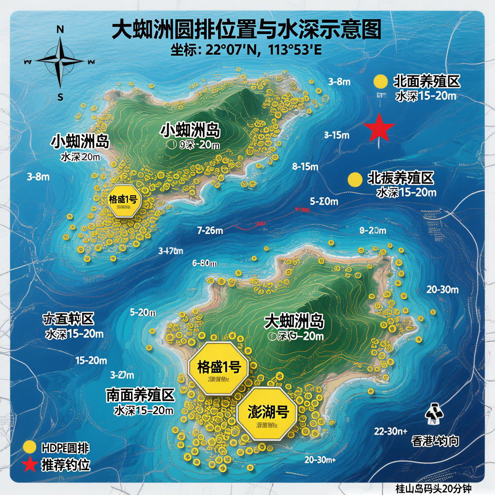

# 桂山岛大蜘洲筏钓攻略 — 2026年3-4月 黑牛(黑鲷)计划

## 🎯 目标

- **鱼种**: 黑鲷(俗称"牛屎鱼"、"黑牛")
- **目标**: 5斤以上(约2.5kg)
- **钓法**: 鱼排筏钓

---

## 一、为什么选4月?（黄金期解释）

黑鲷是**暖温性底层鱼类**，生活习性决定了4月是最佳窗口：

1. **水温触发迁移**: 黑鲷适宜水温17-25℃，9℃以下停止摄食。珠海海域3月水温约16-18℃(刚刚达标)，4月升至18-22℃(正好进入最佳范围)，鱼的活性和食欲大幅提升。
2. **产卵洄游**: 黑鲷每年春季从外海深水区**游向近岸浅水区交尾产卵**，南海地区产卵期在4-5月。产卵前食欲极其旺盛，需要大量进食储备能量，所以**疯狂咬钩**。
3. **窗口只有半个月**: 大黑鲷集中到浅水区的时间约半个月，错过就要等秋季(9-11月)。
4. **3月 vs 4月**: 3月属于早春，水温刚到临界值(16-18℃)，黑鲷活性中等，大鱼还在深水区。4月水温更高、鱼群更集中、咬口更猛。

> **结论**: 3月可以试钓练手，但真正的5斤以上大黑鲷要靠4月。
> 
> 📄 **详细科学论证**: 见 [4月黑鲷开口论证_科学依据.md](4月黑鲷开口论证_科学依据.md)

---

## 二、为什么选小潮期?

### 原理
- **小潮期**(农历初七至十四、二十一至二十八): 太阳和月球引力不在一条线上，引潮力小，潮水涨落**平稳缓慢**。
- **大潮期**(农历初一至初三、十六至十八): 日月引力叠加，潮水涨落**剧烈**。

### 为什么小潮更适合筏钓黑鲷?
1. **流水缓**: 鱼可以从容觅食，在钓点停留时间长，咬钩率高。
2. **饵料沉底**: 钩饵能稳稳沉到海底(黑鲷贴底觅食)，不会被水流冲走。
3. **手感灵敏**: 线组垂直，鱼咬钩的信号能直接传到竿尾，不会被水流干扰。
4. **大潮的问题**: 水流急 → 鱼游不住 → 需要换大坠 → 灵敏度下降 → 难钓。

---

## 三、钓点分析：大蜘洲鱼排怎么选?

### 3.1 大蜘洲地理位置

蜘洲列岛位于珠江口外万山群岛北部:
- **坐标**: 北纬22°06.7′~22°07.7′, 东经113°51.9′~113°54.0′
- **周围**: 东接外伶仃岛，南靠桂山岛，西望万山列岛，北对香港
- 从桂山岛码头乘快艇往东约20分钟到达

### 3.2 我们上的圆排是什么?

我们上的黄色圆排 = **HDPE重力式深水网箱**（免费的废弃/闲置圆排）

**圆排参数**（根据桂山现代渔业产业园环评数据）:
- **材质**: 高密度聚乙烯(HDPE)，黄色浮管
- **规格**: 周长60-90米，直径约20-25米
- **网深**: 6+1米（网箱入水深度约7米）
- **养殖水体**: 单口约2000-4500立方米

> **为什么是"免费"的?** 这些圆排是养殖公司投放的重力式网箱，部分已闲置或完成养殖周期，钓友可以免费上排作钓。圆排漂浮在海面，有浮管可以站/坐，但**没有遮阳棚、没有厕所**，需自带装备。

### 3.3 圆排地理位置与水深示意图

> 📍 基于Google卫星地图实拍 + 环评报告数据 | 坐标：22°07'N, 113°53'E



#### 精确地理示意图（基于Google卫星图实拍绘制）

```
                              ← 香港方向(北)
                    
                         银角咀
                          ╱╲
                    北湾 ╱    ╲
                       ╱  三湾  ╲
                      │ 牛角咀   │
                      │  牛角湾  │ 二湾          大蜘洲 (东侧)
                      │         │              ╱
                      │ 蜘洲村   ├────────────╱  孖石咀
                      │         │  大 蜘 洲  │
                      │ 蜘洲湾   │ (1.67km²) │  散石湾
                       ╲        │            │
                扁顿湾   ╲      ╱╲          ╱
               ╱          ╲──╱    ╲──────╱
    小蜘洲    ╱   鬼顿湾         一湾
   ┌────────┐╱              一湾咀
   │东角咀    │
   │  细洲湾  │   鬼顿湾
   │ 小 蜘 洲 │
   │西角咀    │
   └────┬───┘
        │  散石湾
        │(小蜘洲)
        │
   ╔════╧══════════════╗      ← 桂山岛码头方向(南偏西)
   ║  ★ 养 殖 圆 排 区  ║         快艇约20分钟
   ║                    ║
   ║  ○ ○ ○ ○ ○ ○ ○   ║    ○ = HDPE圆排 (C60/C90)
   ║  ○ ○ ○ ○ ○ ○ ○   ║
   ║  ○ ○ ○ ○ ○ ○ ○   ║    ☆ = 我们免费上的黄色圆排
   ║  ○ ○ ○ ○ ○ ○ ○   ║
   ║  ☆ ☆ ☆ ○ ○ ○ ○   ║    养殖区水深: 13-20m
   ║                    ║    C60×76口 + C90×30口
   ║  [格盛1号] [澎湖号]║    + 大型养殖平台2座
   ╚════════════════════╝

   比例尺: ├──── 约500m ────┤
```

#### 水深分区详图

```
                     (北)
                      ↑
    ──────────────────┼──────────────────
    水深 20-30m+      │      水深 20-30m+
    (开阔外海)        │      (开阔外海/北湾方向)
                      │
              ┌───────┴────────┐
              │   大 蜘 洲     │
              │                │
              │   岸边 3-8m    │
              │   (礁石底质)    │
    ─ ─ ─ ─ ─│─ ─ ─ ─ ─ ─ ─ ─│─ ─ ─ ─ ─
    小蜘洲    │                │
    ┌──┐      │                │
    │  │ ★推荐 │                │    水深 20-30m+
    └──┘ 钓位  └────────────────┘    (东侧外海)
     │  8-15m
     │  (两岛间水道)
     │
     ▼
    ╔════════════════╗
    ║  圆排养殖区     ║
    ║  水深 13-20m    ║    ← 卫星图上可见的整齐排列圆排
    ║  ○○○○○○○○○    ║
    ║  ○○○○○○○○○    ║
    ╚════════════════╝
         │
         ↓ (南)
    桂山岛方向
```

**图示说明**:
- ○ = HDPE重力式圆排（深水网箱）
- ☆ = 免费黄色圆排（我们上的圆排）
- ★ = 推荐钓位（两岛之间水道，水深8-15米）

> ⚠️ **卫星图关键发现**: 从Google卫星图可以清楚看到，**圆排养殖区位于小蜘洲的西南方向**（图上左下角），排列非常整齐。两岛之间的水道（扁顿湾/鬼顿湾）是涨退潮水流通道，也是黑鲷觅食的必经之路。

**实测水深分区**（数据来源：环评报告 + Google地图标注）:

| 区域 | 水深 | 说明 |
|------|------|------|
| 大蜘洲/小蜘洲近岸 | 3-8米 | 礁石底质，有牡蛎附着 |
| 两岛之间水道 ★ 扁顿湾/鬼顿湾 | 8-15米 | **黑鲷必经之路，最佳钓位** |
| 小蜘洲西南 圆排养殖区 | 13-20米 | C60×76口 + C90×30口 + 方排36口 |
| 大蜘洲北面 产业园一期 | 15-20米 | C90×18口 + 养殖平台2座 |
| 外海区域（东/北/西） | 20-30米+ | 格盛1号/澎湖号大型平台 |

> 从桂山岛码头乘快艇往**西南方向**约20分钟到达

### 3.4 综合水深分析

根据环评数据、Google卫星图和深水网箱设置标准（网箱需水深≥15米），各区域水深：

| 区域 | 地理方位（卫星图） | 水深 | 说明 |
|------|-------------------|------|------|
| **岛屿近岸** | 两岛沿岸各湾 | 3-8米 | 礁石底质，有牡蛎附着（牛角湾/蜘洲湾/细洲湾等） |
| **两岛间水道** ★ | 扁顿湾/鬼顿湾（两岛之间） | 8-15米 | 潮水通道，水流适中，**黑鲷必经之路** |
| **主养殖区(圆排)** | 小蜘洲西南方向 | 13-20米 | C60×76口+C90×30口，卫星图可见整齐排列 |
| **产业园一期** | 大蜘洲北面 | 15-20米 | C90×18口+养殖平台2座 |
| **开阔外海** | 各方向外海 | 20-30米+ | 格盛1号/澎湖号大型平台 |

> **圆排下方实际作钓水深**: 圆排网箱入水深度约7米，网箱底部下方还有6-13米的水层到海底。你的线组穿过网箱旁边到海底，**实际作钓水深约13-20米**。

### 3.5 钓位选择：上哪个圆排?

#### ✅ 最佳选择：两岛之间水道的圆排

**原因**:
1. **黑鲷必经之路**: 涨退潮时海水从两岛间的水道流过，黑鲷沿水道觅食迁移
2. **水深适中(8-15米)**: 正好是黑鲷最爱的觅食水层(5-15米)
3. **有岛屿遮挡**: 大蜘洲和小蜘洲形成天然屏障，风浪小
4. **天然窝料**: 靠近养殖区，饲料残渣随水流漂到这里

#### ⚠️ 其次选择：主养殖区（小蜘洲西南方向）靠岛侧的圆排

**原因**: 水深13-20米，圆排密集，有天然窝料，但水深较深需要更重的坠

#### ❌ 避免：外海方向远离岛屿的圆排

**原因**: 水太深(20米+)、风浪大、无岛屿遮挡、不安全

### 3.6 具体钓位原则

- **涨潮钓南，退潮钓北**: 涨潮时鱼随潮水从南面涌入，退潮时鱼往北面深水区退
- **选靠岛侧的圆排**: 同一排圆排，选离岛近的那个，有遮挡且水浅
- **首选有牡蛎附着的圆排**: 观察浮管下方有没有牡蛎壳，有的话说明黑鲷常来啃食
- **避开正在养殖的圆排**: 有人看管的、有鱼在里面游的，不要上去

---

## 四、2026年3-4月出钓日历

### 3月(早春试钓)

| 日期 | 星期 | 农历 | 潮汐 | 风力(海面) | 推荐 | 备注 |
|------|------|------|------|------------|------|------|
| **3月14日** | **六** | 正月廿六 | 小潮 | 3-4级 | ★★★ | 晴转多云，风力OK，潮汐佳 |
| **3月15日** | **日** | 正月廿七 | 小潮 | 3-4级 | ★★★ | 多云，风力OK，适合出钓 |
| 3月20日 | 五 | 二月初二 | 中潮 | **4-5级⚠️** | ❌ | 风力超标，不出 |
| 3月21日 | 六 | 二月初三 | 中潮 | 3-4级 | ★★ | 阴天，潮汐一般 |
| 3月22日 | 日 | 二月初四 | 小潮 | 3-4级 | ★★ | 阴天，看实况 |
| 3月24日 | 二 | 二月初六 | 小潮 | **4-5级⚠️** | ❌ | 风力超标，不出 |

> **3月结论**: **本周末3月14-15日是最佳窗口**！小潮+风力OK+晴/多云。水温16-18℃，黑鲷活性中等，建议用**活饵**(南极虾、活虾)增强诱鱼。3月更多是练手和试水。

---

### 4月(黄金期 ★★★)

| 日期 | 星期 | 农历 | 潮汐 | 推荐 | 说明 |
|------|------|------|------|------|------|
| **4月3-8日** | 五-三 | 二月十七至二十二 | 小潮 | ★★★ | **绝对黄金期**，含清明假期 |
| 4月9-11日 | 四-六 | 二月二十三至二十五 | 中潮 | ★★ | 可出钓，鱼口一般 |
| **4月12-15日** | 日-三 | 二月二十六至二十九 | 小潮 | ★★★ | 黄金窗口中期 |
| 4月16-18日 | 四-六 | 三月初一至初三 | 大潮 | × | **避免**，初三最高潮 |
| **4月19-25日** | 日-六 | 三月初四至初十 | 中转小潮 | ★★★ | 恢复出钓 |
| **4月26-30日** | 日-四 | 三月十一至十五 | 小潮 | ★★★ | 4月最后机会 |

---

## 五、天气条件与风力预报

### 🚨 硬性标准：超过4级风不出！

> **为什么4级是红线?** 
> - 4级风(5.5-7.9m/s)对应海面浪高0.5-1.0米，圆排开始明显晃动
> - 圆排没有遮挡和扶手，浪大时站不稳，非常危险
> - 风大→浪大→走水严重→饵料留不住→鱼也不靠边觅食
> - **珠海海域特点**: 陆地风力和海面风力差距大！陆地2-3级时，万山/桂山附近海面通常4-5级阵风6级

### 📊 最近半个月风力预报（3月12日-26日）

> 数据来源: 中国天气网 + 珠海气象台海洋预报（2026-03-11 18:00更新）
> 
> ⚠️ **重要**: 以下陆地风力需+1~2级换算为海面风力！

| 日期 | 星期 | 天气 | 陆地风力 | 海面风力(估算) | 能否出钓 |
|------|------|------|----------|----------------|----------|
| 3月12日 | 四 | ☀️ 晴 | <3级 | 3-4级 | ✅ 可以 |
| 3月13日 | 五 | ☀️ 晴 | <3级转3-4级 | 4-5级⚠️ | ❌ 不建议 |
| **3月14日** | **六** | ☀️ 晴转多云 | <3级 | 3-4级 | ✅ **可以出钓** |
| **3月15日** | **日** | ☁️ 多云 | <3级 | 3-4级 | ✅ **可以出钓** |
| 3月16日 | 一 | ☁️ 多云 | <3级 | 3-4级 | ✅ 可以 |
| 3月17日 | 二 | ☁️ 多云 | <3级 | 3-4级 | ✅ 可以 |
| 3月18日 | 三 | ☁️ 多云 | <3级 | 3-4级 | ✅ 可以 |
| 3月19日 | 四 | ☁️ 多云 | <3级 | 3-4级 | ✅ 可以 |
| 3月20日 | 五 | 🌥️ 阴转多云 | 东风3-4级 | **4-5级⚠️** | ❌ **不出** |
| 3月21日 | 六 | ☁️ 多云转阴 | <3级 | 3-4级 | ✅ 可以 |
| 3月22日 | 日 | 🌫️ 阴 | <3级 | 3-4级 | ⚠️ 看实况 |
| 3月23日 | 一 | ☁️ 多云 | <3级 | 3-4级 | ✅ 可以 |
| 3月24日 | 二 | ☁️ 多云 | 东南风3-4级 | **4-5级⚠️** | ❌ **不出** |
| 3月25日 | 三 | ☁️ 多云转阴 | <3级 | 3-4级 | ✅ 可以 |
| 3月26日 | 四 | ☁️ 多云 | <3级 | 3级 | ✅ 可以 |

### 🎯 最近半个月最佳出钓窗口

| 推荐排名 | 日期 | 原因 |
|----------|------|------|
| ★★★ | **3月14-15日(周末)** | 风力小+小潮期(正月廿六廿七)+晴/多云 |
| ★★ | 3月16-19日(周一至四) | 风力小+多云，但工作日 |
| ★★ | 3月21-23日(周六至一) | 风力小，但阴天为主 |
| ❌ | 3月13日 / 3月20日 / 3月24日 | 风力达4-5级，不安全 |

> **⚠️ 提醒**: 以上为8-15天趋势预报，出发前一天务必再查一次最新预报！
> 推荐查看: **Windy.com**（搜索坐标 22.12, 113.87）可看逐小时海面风力。

### ✅ 出钓标准
- **气温**: 15-24℃（体感舒适）
- **风力**: 海面**4级以下**（陆地<3级）
- **天气**: 晴天 / 多云 / "斜风细雨"(有雨不寒) / 阵雨之后

### ❌ 绝对不出钓
- **海面风力超过4级**（含阵风5级以上）
- 阴冷超过12小时
- 闷热、台风、雷雨
- 晴而无风(鱼讯差，原因: 气压高、水中溶氧变化小，鱼不活跃)

### 最佳作钓时段
- **3月(早春)**: 中午前后(水温最高时段)
- **4月(春季)**: 全天适合，上午一般有一小时集中鱼口

---

## 六、装备与饵料

### 筏钓钓具

| 装备 | 规格 | 说明 |
|------|------|------|
| **筏竿** | 1.5-1.8米软尾筏竿 | 竿尖要软，看顿口全靠竿尖 |
| **轮子** | 微物筏钓轮/小鼓轮 | 出线顺畅、刹车灵敏 |
| **主线** | PE线0.8-1.5号 | 拉力强、不延伸、传递信号灵敏 |
| **前导线** | 2-3号碳氟线(1-1.5米) | 碳氟线耐磨隐蔽、切水好 |
| **鱼钩** | 3-5号千又钩/管付伊势尼 | 钩尖锋利，适合黑鲷硬嘴 |
| **铅坠** | 滑铅/通心坠 10-30g | 根据水流调整重量，走水大用重坠 |

> ⚠️ **筏钓没有浮漂！** 筏钓全靠**看竿尖**和**手感**来判断鱼讯。竿尖的微微下顿、回弹就是咬口信号。

### 最佳饵料: 生蚝肉

**为什么用生蚝?** 黑鲷最爱吃牡蛎，在自然环境中就靠啃食礁石上的牡蛎为生。用生蚝钓黑鲷，等于给它送"最爱的饭菜"。

**操作方法**:
1. 打开一粒生蚝，保留蚝肉连壳的弯曲面
2. 蚝肉与壳分离，但肌腱留在壳上
3. 钩住白色蚝肉，蚝壳充当天然铅坠(一举两得)
4. **效果**: 10个生蚝能上8条鱼(熟手)

### 替代饵料
- 南极虾(增加晃饵动作刺激食欲)
- 小杂鱼、活虾(活饵 > 死饵)
- 虾仁(挂钩方便，新手友好)

### 打窝
- 养殖区一般不需要打窝(天然窝料)
- 需要时: 取5-8粒生蚝稍微敲打(不要太碎)，投入钓点

---

## 七、筏钓钓法要点

### 核心原理：看竿尖 + 手感

筏钓**不用浮漂**，全凭两个信号通道判断鱼讯：
1. **视觉（看竿尖）**: 竿尖下点=有鱼在啃；突然下弯不回弹=鱼吃死口了
2. **触觉（手感）**: 主线传来"哒哒哒"的细微触感=鱼在试探；沉重下拉感=鱼吃牢了

### 生蚝筏钓流程

1. **挂饵下放**: 钩好生蚝 → 打开线杯/刹车 → 让钩饵自由下落到底
2. **触底确认**: 线组不再出线 = 到底了 → 收紧余线让竿尖微弯(绷尖状态)
3. **等候鱼讯**: 眼睛盯住竿尖，手扶竿身感受震动
4. **判断咬口**:
   - 竿尖轻微点动 → 鱼在试探，**不要动，等！**
   - 竿尖明显下弯 → **准备扬竿**
   - 竿尖被拉下后不回弹/线被拉走 → **鱼吃死口了，杀！**
5. **扬竿刺鱼**: 手腕发力快速上扬，刺穿黑鲷硬嘴
6. **遛鱼**: 黑鲷第一波冲击力最猛，控住竿别松刹车，来回遛3-5个回合
7. **15分钟无鱼讯 → 换饵重下**（生蚝泡久了没味道）

### 黑鲷关键技巧

- **安静**: 黑鲷生性多疑警戒性强，避免制造光影和声音。圆排上不要跳、不要大声说话
- **等口要耐心**: 竿尖第一下点动**千万不要扬竿**！黑鲷是用门牙啃的，要等它整个吃进去。心里默数"1、2、3"，感觉竿尖持续弯下去再杀竿
- **群鱼效应**: 钓到一条说明附近有一群，继续钓同一位置
- **铅坠贴底**: 筏钓黑鲷就是钓底，确保铅坠到底、钩饵贴海底

### 杂鱼闹窝？→ 避杂鱼钓大物完整攻略

> 📄 **详细方案**: 见 [圆排筏钓避杂鱼钓大物_研究报告.md](圆排筏钓避杂鱼钓大物_研究报告.md)
> 
> **速记口诀**: 大饵硬饵带壳下，重坠直沉到海底，大钩粗线滤小鱼，清晨傍晚黄金时！
> 
> **杂鱼口 vs 大鱼口**: 快碎乱浅 = 杂鱼（无视）；慢沉稳深 = 大鱼（杀竿！）

### 走水应对（筏钓专用）

| 走水程度 | 现象 | 应对方法 |
|----------|------|----------|
| **轻走水** | 线组微微倾斜 | 不管它，正常钓 |
| **中走水** | 线组明显倾斜，竿尖拉弯 | 加重铅坠(15→25g)，缩短前导线 |
| **重走水** | 线组被冲到接近水平 | 换30g以上重坠，绷尖钓法(线绷直，看竿尖任何异常动作就杀竿) |
| **走水太严重** | 怎么加坠都留不住 | 换到另一侧下竿(圆排是圆的，换个方向找背流点) |

> 💡 **圆排筏钓的独特优势**: 圆排是360度的，哪个方向水流缓就去哪边下竿。不像方排只能在固定位置钓。

---

## 八、安全事项

1. **必须穿救生衣**，全程不得脱掉
2. 结伴出钓，不单独行动
3. 选择合法经营的钓鱼船/鱼排
4. 避开"三无船舶"(无船名、无证书、无船籍港)
5. 关注实时天气预报，风浪过大立即停止
6. 队友抛投时从身后绕行，防止被鱼钩伤到
7. 不要用手指伸进鱼嘴摘钩

---

## 九、正常收获预期

- 三人出钓，收获一条黄脚+一些小鱼属于正常
- 上午一般有一小时集中有口，下午2点偶尔有口，5点收竿
- 4月黄金期+小潮+好天气+正确钓法 = 大幅提高中大鱼概率

---

## 📎 实用链接

- 珠海气象局(实时天气): http://weather.zhuhai.gov.cn/
- 桂山岛潮汐表: https://www.chaoxb.com/141/
- 大鱼潮汐表: https://www.chaoxibiao.net/

---

**祝钓获满满，收获5斤大黑牛!** 🐟🎣
